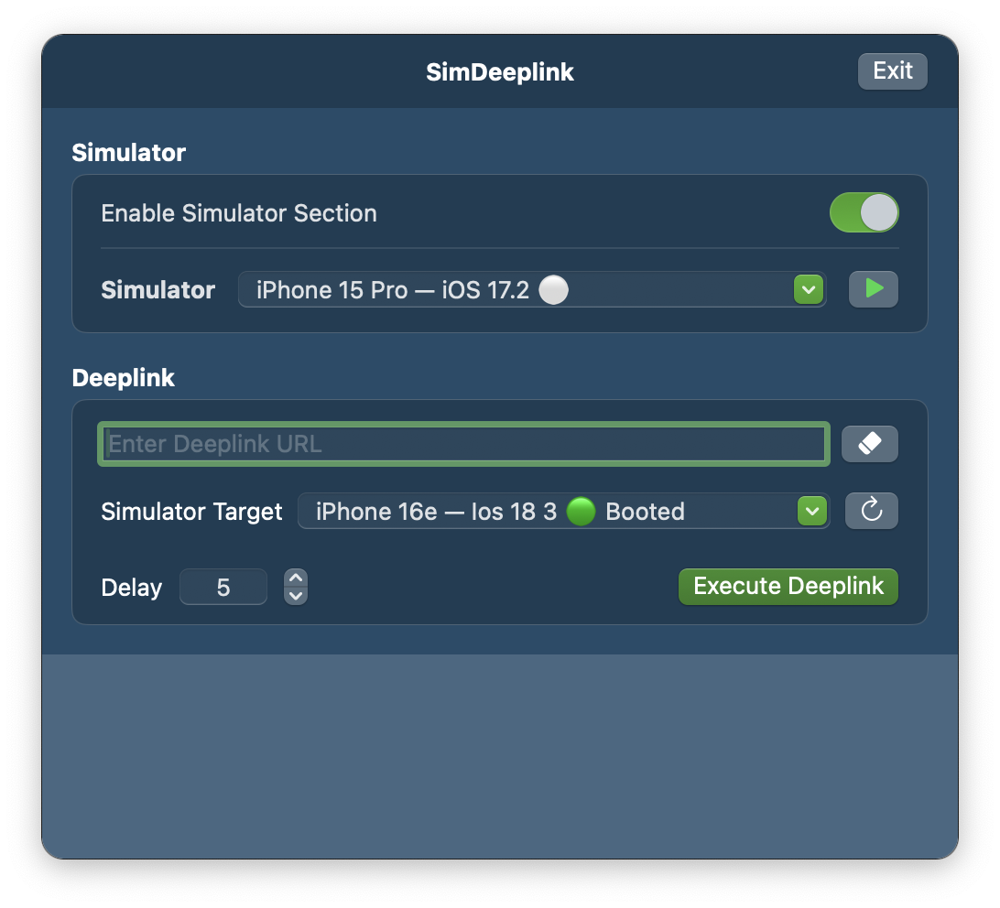

<p align="center">
  
</p>

# SimDeeplink (Menu Bar)

SimDeeplink (Deeplink Runner) is a desktop utility designed to make testing and running app deeplinks in Simulator effortless. Unlike other solutions, there’s no need to drag and drop URLs onto Simulator—you simply paste and run! The app lives comfortably in your macOS menu bar, allowing quick access at any time.

<p align="center">
  
</p>

## ✨ Features

- **Paste and Run Deeplinks Instantly:** Just paste your deeplink and run it in Simulator—no drag-and-drop required.
- **Delay:** Add delay to wait for the simulator to be ready to watch.
- **Specific Simulator Target:** Choose your right target for running deeplink.
- **Menu Bar Access:** Launch and use the app from your menu bar on any Mac desktop, for maximum convenience.
- **Simulator Booting:** The app can automatically boot the Simulator if it’s not running, so you can execute deeplinks immediately.

## 🧭 Installation

### 🪄 Using Homebrew (Recommended)

You can install `SimDeeplink` directly via `Homebrew`:

  ```bash
  brew install --cask alifu/tap/simdeeplink
  ```

Once installed, you can open it from Launchpad or via:

  ```bash
  open -a SimDeeplink
  ```

💡 Tip: For clean update, please run below command:

  ```bash
  // first uninstall the app
  brew uninstall --cask alifu/tap/simdeeplink

  // then install again
  brew install --cask alifu/tap/simdeeplink 
  ```

### ⚠️ Handling Homebrew Warnings

If you see a warning like:

> Warning: Cask 'simdeeplink' is not notarized and may not be trusted by macOS.

or

> “SimDeeplink.app” can’t be opened because Apple cannot check it for malicious software.

This is expected if the app is not yet notarized (since we’re not using an Apple Developer account).

To run it safely:
1. Open `System Settings` → `Privacy & Security`
2. Scroll down until you see the blocked app message
3. Click **“Open Anyway”**
4. Then confirm by clicking **“Open”** in the popup

macOS will remember your choice, and you won’t see the warning again.

### 🧰 Manual Installation (Alternative)

If you prefer manual installation:
1. Download the latest release from GitHub Releases
2. Unzip the file
3. Move SimDeeplink.app to your Applications folder

### ✅ Uninstallation

To uninstall SimDeeplink and remove its configuration files:

  ```bash
  brew uninstall --zap --cask simdeeplink
  ```

## 💡 Why Use This?
- Eliminate repetitive drag-and-drop steps for deeplink testing.
- Stay focused—access the tool instantly from your menu bar.
- Works with any desktop setup.
- Streamlines the developer workflow, especially for QA and app review scenarios.

## 🧪 Roadmap

| Status | Feature |
|:-------:|-----|
|✅|**Running Deeplink:** Just paste the deeplink and GO!|
|✅|**Simulator Section:** Choose and boot the XCode Simulator without XCode (We can disabled this feature if no needed)|
|✅|**Add Timer for Deeplink Execution:** Allow users to specify a delay before running a deeplink, making it easier to wait for the simulator to be ready.|
|🚧|**Android Emulator Support:** Enable deeplink runs in Android Emulator for cross-platform testing.|
|🚧|**Distribute via Homebrew:** Publish the app through Homebrew for easy installation. Currently, run the project from source as described above.|

## ⚙️ Contributing
Contributions and feedback are welcome! Please open an issue or submit a pull request with ideas or improvements.

### 🚀 Getting Started

#### Prerequisites
- Xcode 15 or later  
- MacOS 14.0+ target  
- Swift 5.9+

#### Installation

1. Clone this repository:

   ```bash
   git clone https://github.com/alifu/SimDeeplink.git
   cd SimDeeplink
   ```
2. Open the project:

   ```bash
   open SimDeeplink.xcodeproj
   ```
3. Select the appropriate target and scheme (usually 'SimDeeplink' or similar).
4. Build and run (⌘R). The app should appear in your menu bar.

## 🪪 License
MIT License. See [`LICENSE`](./LICENSE) for details.

---

> _Built with passion and love ❤️  
> — [@alifu](https://github.com/alifu)